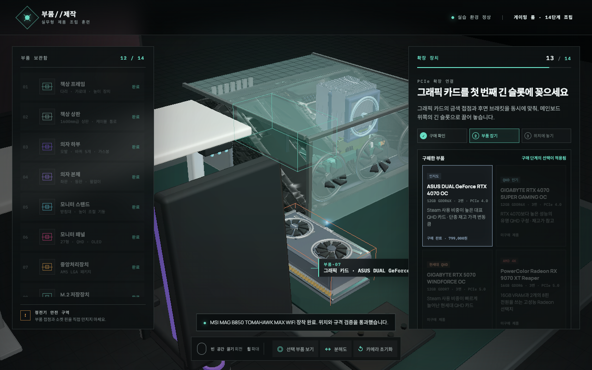
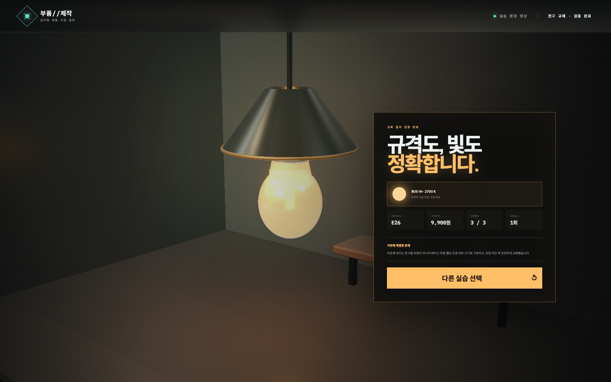

# 부품제작 — 인터랙티브 제품 조립 실습실

제품마다 다른 문제 해결 과정을 3D로 연습하는 실습형 프로토타입입니다. 현재 메인 화면에서 `게이밍 컴퓨터 조립`과 `전구 교체 진단`을 선택할 수 있습니다.

## 현재 구현

- Blender에서 생성한 고밀도 3D 부품과 제품 식별 디테일
- Neural4D 2.5로 생성한 100만 면·4K PBR 케이스 원본과 179,999면 게임용 최적화본
- 12개 구매 품목, 품목별 실제 제품 2개, 실시간 총액 견적
- 구매한 SKU에 따라 달라지는 책상·의자·모니터·케이스·PC 부품 외형
- MSI MAG B850 TOMAHAWK MAX WIFI, AMD Ryzen 5 9600X, SK hynix Platinum P41, Kingston FURY Beast RGB, Thermalright PA120 SE ARGB, CORSAIR RM850e, ASUS DUAL RTX 4070 OC 대표 구성
- 실제 비율의 ATX 메인보드, AM5 CPU, M.2 2280 SSD, DDR5 키트, 듀얼타워 공랭 쿨러, 모듈러 PSU, 2팬 GPU와 전원 케이블
- PBR 금속·PCB·구리·목재·고무·LED 머티리얼
- 부품 종류마다 호환 가능한 선택지 2개와 용도·차이 설명
- 3D 부품을 마우스로 직접 끌어 목표 위치에 놓는 수동 조립
- 목표 장착부 홀로그램, 3단계 진행 표시, 거리·방향 피드백
- 가구·디스플레이 6단계와 PC 8단계를 합친 총 14단계 조립 가이드
- 조립 중부터 계속 동작하는 팬 9개와 RGB 순환 조명, 최종 게이밍 룸 배치와 전원 인가 자체 검사
- 데스크톱·모바일 반응형 UI
- Unreal 프로젝트와 자동 임포트 스크립트 골격
- 메인 화면의 컴퓨터 조립·전구 교체 모듈 선택
- 기존 전구·소켓·조명 갓·조광기를 살펴 요구 규격을 완성하는 현장 조사
- 실제 판매 사양을 반영한 전구 후보 6개와 베이스·루멘·켈빈·조광·크기별 오답 피드백
- 스위치·차단기·냉각 상태를 확인하는 안전 잠금 절차
- 마우스로 원을 그려 반시계 방향 분리와 시계 방향 장착을 수행하는 전용 조작
- 교체한 2700 K 전구의 점등·조광 검증과 따뜻한 방 조명 연출

## 실행

```bash
npm install
npm run dev
```

브라우저에서 `http://127.0.0.1:5173`을 엽니다.

구매 화면에서 품목별 제품을 고르고 총액을 확인한 뒤 조립을 시작합니다. 화면 속 구매 부품을 빛나는 장착 영역까지 직접 끌어 놓으며, 목표에서 멀리 놓으면 부품이 원위치로 돌아오고 다음 이동 방향이 표시됩니다.

전구 교체에서는 먼저 3D 현장의 네 단서를 조사합니다. 요구 규격과 제품 포장을 비교해 전구를 구매하고, 안전 절차를 마친 뒤 원형 제스처로 기존 전구를 풀고 새 전구를 장착합니다.





```bash
npm test
npm run build
```

## Blender 자산 재생성

```bash
npm run assets
```

- 소스: `assets/pc-lab-source.blend`
- Neural4D 원본: `assets/neural4d/atx-case-source.glb`
- Neural4D 미리보기: `assets/neural4d/atx-case-preview.jpg`
- 웹/Unreal 공용 출력: `public/models/pc-lab.glb`
- 생성기: `tools/build_pc_scene.py`

Neural4D 원본이 있으면 생성기가 외부 껍질을 자동으로 가져와 실제 ATX 비례로 축을 맞추고 18만 면 안팎으로 최적화합니다. 조립 위치, 부품 ID와 팬 애니메이션은 기존 결정적 모델을 유지하므로 웹과 Unreal의 상호작용 계약이 바뀌지 않습니다.

제품형 모델은 제조사 공개 치수와 제품 사진을 학습 참고로 사용해 조립 교육용으로 단순화한 프로젝트 전용 자산입니다. 제품명과 상표의 권리는 각 제조사에 있으며 이 프로젝트는 해당 제조사의 공식 제품 시각화 또는 보증 자료가 아닙니다.

현재 케이스와 시스템 팬은 3D 모델에 포함되어 있지만 독립 조립 단계가 아닌 고정 환경입니다. CPU, 메인보드, 메모리, SSD, 쿨러, 그래픽 카드, 전원공급장치, 전원 케이블은 직접 조립합니다. SATA 저장장치, 무선 확장 카드, 수랭 쿨러, RGB 허브 같은 선택 부품은 아직 포함하지 않았습니다.

## Unreal 연결

현재 컴퓨터에는 Unreal Editor가 설치되어 있지 않아 에디터 실행 검증은 할 수 없습니다. `unreal/BuildLab/BuildLab.uproject`를 Unreal에서 연 다음 Python Editor Script Plugin을 켜고 아래 스크립트를 실행하면 GLB를 `/Game/BuildLab/Meshes/DesktopATX`로 가져오도록 준비했습니다.

```text
unreal/BuildLab/Scripts/import_build_lab.py
```

웹과 Unreal은 `public/data/desktop-atx.json`의 동일한 부품 ID와 조립 단계를 사용합니다.

## 조사 기준과 시각 참고

- [Intel PC 조립 가이드](https://www.intel.com/content/www/us/en/gaming/resources/how-to-build-a-gaming-pc.html): CPU, M.2, RAM, PSU, 메인보드, GPU, 저장장치 설치 순서와 POST 확인
- [CORSAIR Build Kit 가이드](https://www.corsair.com/us/en/explorer/diy-builder/bundles-and-complete-pc-build-kits/corsair-build-kit/): 실제 케이블 경로와 24-pin, CPU 보조전원, GPU 설치 절차
- [ASUS CPU 설치 가이드](https://www.asus.com/support/faq/1047659/): 소켓 규격 확인, 삼각형 기준점과 노치 정렬
- [ASUS ProArt X870E Creator](https://www.asus.com/motherboards-components/motherboards/proart/proart-x870e-creator-wifi/): AM5, DDR5 DIMM 4개, PCIe x16, M.2 2280, 전원 헤더의 배치 참고
- [Fractal Design North XL](https://www.fractal-design.com/products/cases/north/north-xl/charcoal-black/): 503 × 240 × 509 mm 섀시, 7개 확장 슬롯, 케이블 라우팅과 목재 전면 흡기 구조 참고
- [IKEA Korea LED 전구](https://www.ikea.com/kr/ko/cat/led-bulbs-20514/): E26·E14·GU10 베이스, 루멘, 색온도, 조광 여부와 국내 판매가 참고
- [ENERGY STAR 밝기 안내](https://www.energystar.gov/products/learn-about-brightness): 와트가 아닌 루멘으로 밝기를 비교하는 구매 기준
- [ENERGY STAR 조명 선택](https://www.energystar.gov/products/light_fixtures): 켈빈 색온도와 조광기 호환성 확인 기준
- [CPSC 전구 안전 안내](https://www.cpsc.gov/Recalls/2004/cpsc-osram-sylvania-products-inc-announce-recall-of-decorative-light-bulbs): 전원 차단과 파손 전구 취급 원칙

## 교육 범위

현재 버전은 실무 교육을 대체하거나 자격을 인증하지 않는 훈련 보조 프로토타입입니다. 전구 모듈은 전구 자체 교체만 다루며 소켓·배선 수리를 안내하지 않습니다. 소켓의 파손·그을림·노출 배선이 보이면 작업을 멈추고 전기 전문가에게 점검을 요청해야 합니다. 다음 단계에서 실제 조립·전기 전문가 검수를 거쳐 체결 토크, 케이블 규격과 실패 진단 시나리오를 제품군별로 분리해야 합니다.
